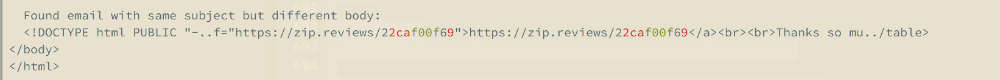

We've all ran that test that failed and it dumped a two walls of text on you, one as the expected and the other as the reality.
Your job is to figure out how the two walls of text are different. An example is testing the content of an email
body.

Well, I made a helper in Elixir that makes this way easier. It will only print a padded excerpt of the part that is
actually different and even show you red/green of whats different.

Here is the function if you'd like to use it:

```elixir
  @doc """
  Truncates the middle of a string
  iex> Utils.String.truncate_middle("some really long string that needs truncating", 10)
  "some..ting"
  iex> Utils.String.truncate_middle("some really long string that needs truncating", 100)
  "some really long string that needs truncating"
  """
  def truncate_middle(str, count) when is_binary(str) and is_integer(count) do
    if String.length(str) < count do
      str
    else
      edges = Integer.floor_div(count, 2) - 2
      front = String.slice(str, 0..edges)
      back = String.slice(str, -(edges + 1)..-1)
      "#{front}..#{back}"
    end
  end

  @doc """
  Formats the difference between to strings for output
  iex> Utils.String.format_diff("zip growth", "zip books")
  "\e[39mzip \e[31mgr\e[32mb\e[39mo\e[31mwth\e[32moks"
  """
  def format_diff(string1, string2) do
    String.myers_difference(string1, string2)
    |> Enum.reduce([], fn
      {:eq, str}, acc -> [IO.ANSI.default_color() <> Utils.String.truncate_middle(str, 50) | acc]
      {:del, str}, acc -> [IO.ANSI.red() <> str | acc]
      {:ins, str}, acc -> [IO.ANSI.green() <> str | acc]
    end)
    |> Enum.reverse()
    |> Enum.join("")
  end
```

Now, when when you have two huge strings with very small differences, you will see this:

