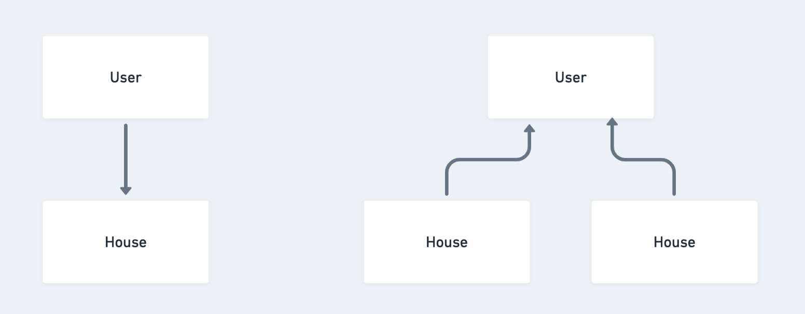

Requirements creep toward the real world because users live in the real world. Software starts off supporting a subset
of what all potential users need. As you expand your market, you add features that support more and more use cases. Your
application’s data model more and more accurately represents the real world.

If the requirements are to let users post a house for rent, we create a user resource, a house resource and
then have the user reference the house as the owner. This is a totally valid data model per the requirements. The
problem is, in the real world, people can own more than one house. If the product is successful, requirements will expand
to support people renting more than one house. You’ll have to do a fun migration to get your model in line with reality.

Anecdotally, I’ve been following this advice for years and it’s almost prescient how effective it is at preparing for
future requirements. Very often, modeling the real world when the requirements don’t call for it (yet) can be more work.
Personally, I almost always do it. First, because modeling the real world is easier to reason about and, second, because
requirements always creep toward the real world.

Another aspect of this is normalization. Things that are fundamentally the same in the real world should be the same in
your data model, even if they are used completely differently. Very often this calls for polymorphism where a resource
belongs to multiple other types of resources. An example is Vendors and Customers. In the real world, these are all
people and companies, so we could call them contacts. Now when you want to tie a contact to an invoice, a bill or a
transaction you don't have to support linking two different types, which are actually the same thing. Also, in the real
world, contacts can be both vendors and customers to the same company. Now the user has duplicate records for who
is, in the real world, the same person.

When you normalize, it might mean you have a lot of null columns, but thats ok because it's not that the column is
irrelevant to that resource. A contact could have both revenue and expenses, but most often, a vendor will have only
expenses and a customer will have only revenue.

Modeling your data after the real world means that when requirements expand, you won't have to change your data model,
you'll just add to it.