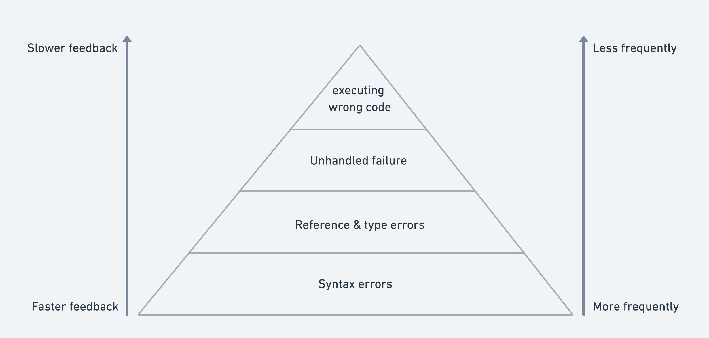

I wrote before about the importance of [fast feedback loops](https://atomkirk.com/2020-07-01-fast-feedback-loops/) and
the [5 categories of bugs](http://localhost:8000/2020-07-16-the-5-categories-of-bugs/) and today I thought about how
this could be represented as a pyramid, much like the [Test Pyramid](https://martinfowler.com/articles/practical-test-pyramid.html#:~:text=The%20%22Test%20Pyramid%22%20is%20a,put%20it%20into%20practice%20properly.).

Toward the bottom are the mistakes we make as programmers most frequently. They are also typically the fastest to catch
and correct.

Syntax errors happen as soon as you save the file and try to build. It's even the very first thing a compiler
will do: parse your files. If it can't parse it, you'll get a syntax error.

Second, we type function/variable names wrong or we forget the shape of data in a variable and use it wrong. If you've
got a good test pyramid, your tests will run fast and often and hopefully catch these problems quickly. But it requires
your tests are thorough and optimized. Let's face it, this is hard and most teams don't. That's why a
lot of teams
are turning to type safety, because you can collapse the second level here into the first so that both syntax and
reference/type errors are caught immediately when you try to compile/build.

Type safety also allows powerful tooling that can tighten feedback loops further by offering relevant suggestions, information
on hover & descriptive inline errors.

And, once again, with languages with value type errors and exhaustive results handling (i.e. Elm, Rust, etc.), you can
even make the third layer of this pyramid provide immediate feedback at build time, further tightening your feedback
loop.
