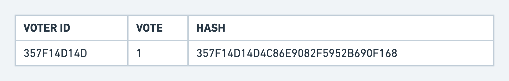
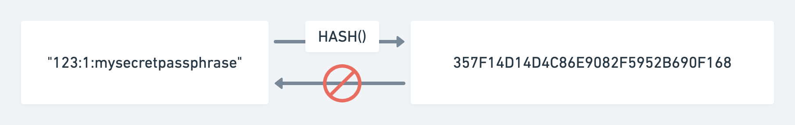

NOTE: This is a work in progress. I've learned since that to make this truly convincing, it has to protect anonimity even better than mail in voting (which doesn't protect it very much).

Our current voting system has the following problems:

- It's slow, things have to be counted by hand.
- Counting by hand makes it error prone. There is always some margin of error.
- A manual process is easy to attack as fraudulent.

So far, making voting electronic and online has been out of the question because of security concerns. To address the security concerns, an online voting system should have the following features:

- Ability for any voter to personally verify that their vote was counted correctly.
- Ability any independent party to verify the results of the election.

I would like to propose a design for a voting system that would allow everyone to vote online in a secure way that they, or anyone else, can personally verify:

#### Voters mailed voter ID

First, the government mails a voter ID to everyone who is eligible to vote. This voter ID is not secret. If
someone swaps or hijack your voter ID, you'll catch it yourself after the election.

#### Vote online

On election day, everyone uses a government website to vote. All they do is enter their voter ID, who they vote for,
and a passphrase of their choosing. They are encouraged to write this down and keep it secret.

The government records each vote in a table with 3 columns:

The first column is generated by combining the voter id with a secret only the government knows. This allows the
dataset to guarantee one vote per voter ID without exposing the voter ID. It also allows the goverment to verify
that a vote exists for a voter ID.

The third column is computed by combining the voter id, the vote and the voters chosen passphrase passed
through a one-way hashing algorithm that obfuscates and "signs" it.

A one-way hash is an algorithm that takes input and scrambles it in a predictable but irreversible way. It's predictable
because if you pass the same inputs, you get the same hash every time. But, if the voter's chosen passphrase is long enough, like say 20
characters and contains numbers and letters, the earth would long be swallowed by the sun before any of todays computers
could brute force what inputs resulted in the hash. This makes it one-way and irreversible.

#### Verify results

As soon as election day ends and the polls are closed and results announced, this 3 column table dataset is shared publicly with the world. It
could be posted by university servers and would be downloadable by anyone.

Anyone could download the dataset, create their own hash of their voter ID, vote and passphrase and then make sure that one of the rows
in the table contains that hash. If it does, they know with certainty that their vote was counted correctly.

After verifying their own vote was counted, they can run a query to sum all the votes and verify the election results as reported by the press.
If a few thousand people do this, verify their own vote was counted in a datase that matches the announced results, there is extremely extremely
high confidence that the results have not been tampered with.

Everyone in the country can help participate in the verification of the database. Thousands of people will verify their own votes, plus they will
verify different datasets match. Multiple independent parties can create ways for non-technical people to verify their own votes.
