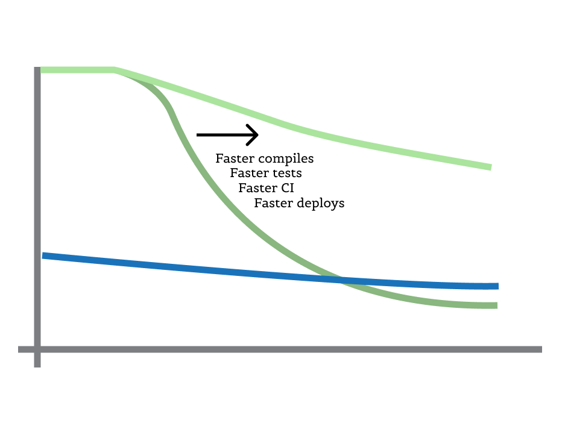

In Martin Fowler's essay "Microservice Premium" he makes the argument that as
the complexity of a system increases, the productivity of a monolith architecture
starts out as very productive, but decreases in productivity faster than a service oriented
architecture (SOA), until a SOA is more productive than the monolith.

Here's a chart he provides to illustrate:

But, come on, when you add all the drawbacks of an SOA, the costs are enormous and they get worse.
Data syncing, backfilling, inconsistencies, progogation of bad data. Books upon books on how to
deal with the problems specific to using an SOA. It takes a truly terribly designed monolith
and a fantastically designed SOA for those lines to cross. The chart should really look like this:

As a project grows, most languages (Java, C++, Elixir)[^1] take longer and longer to compile. Death
by a thousand slow-ish tests build up. CI pipelines take 20+ minutes. With 50 engineers trying
to get their code into master, it takes days to get merged. The vast majority of that
time spent waiting for CI (compiling, tests, linting). You have two options: make all of that
faster, or harken back to the good old days when your project was smaller by splitting it up.

The problem is, in the good old days, all your data was still in one database. That's a terrible
idea in a SOA. Now you're sacrificing all kinds of simplicity and safety to make your project
compile and test faster in smaller pieces. Invalid data being the root of all evil,
giving up foreign key constraints is selling your soul.

Or, you could make things faster:

Seeing as making all of this fast once your project is already huge is very hard to do, I think
there are a few actionable points of advice I would like to leave with people starting new projects:

- Pick a language and ecosystem that prioritizes fast compiles and a fast feedback loop dev experience. i.e. Go.
- Keep your tests fast from day one.
- Do not preoptimize for microservices. Don't over-engineer your code to work like an SOA. If you follow the first two points of advice, you may never have to go there at all. Boundaries are great, so theres a lot of gray area here, but I think its important to keep things [as simple as possible as long as possible](https://atomkirk.com/2020-12-04-simple-as-possible-as-long-as-possible/).

[^1]: Dynamic languages like Ruby, PHP and Node may not need to compile, but because they are dynamic, tests won't run as fast as you could make Go tests run, for example.
