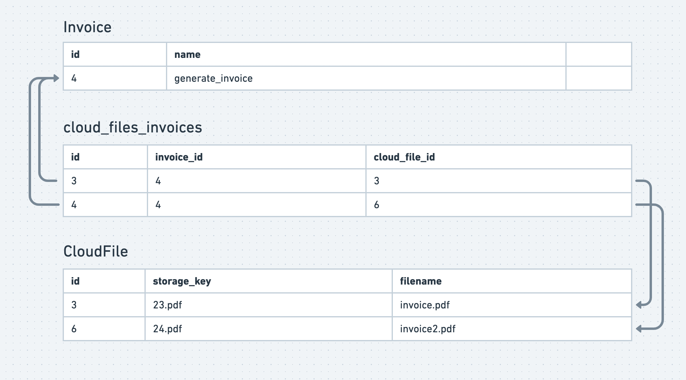

Admittedly, I'm not very good at thinking in the abstract, so a lot of terms in our software development culture
are hard for me to internalize. One of those terms is "Loose Coupling". I thought "well… if I need to reference something,
I need to! How can I reduce the coupling in my application without reducing the requirements!?"

I had an epiphany the other day where I realized that coupling is not about how many references you have, but the direction
of your references. Two things that reference each other are tightly coupled. Where A references B, but B knows nothing
of A, they are loosely coupled.

You can "use" something, but it becomes tightly coupled to you when it only works for you. A car is tightly coupled to you when
the seat, steering wheel and key only fit you and only work for you. No one else can drive it, not even your spouse.

Another way to think about loosely coupled code is code that you could easily publish as open source and it would be
useful to other projects totally unrelated to yours. This is why I recommend writing as much code as you can as if you're
going to open source it, even if you're not. Maybe your work place doesn't allow open source. Doesn't matter! Open source
code is extremely loosely coupled and writing it that way will benefit your internal use of it. Writing loosely coupled
code is writing generally useful code. If it's only useful to one specific task, its tightly coupled to it.

This graph shows the resources in an application where many of the functions have been broken out as "services" (not necessarily
SOA or microservices, but they could very easily become so when the time is right because they are loosely coupled.)

As you can see on the left, some code that is very specific to your application needs to be tightly coupled, and thats fine.
But, if you look for opportunities to write more code as loosely coupled services, more code becomes far more reusable,
either to majorly refactored app code, or future app code. More code more reusable, thats the goal.

What is a reference? It can be either a direct mention of a resource or type specific to your application (e.g. `Account`, `User` or `Invoice`)
or it can be arguments, properties and events that are specific to your application. Usually, if you can remove any
mention to anything specific to your app, you're pretty much there (e.g. an option called `hidden` instead of `hiddenToUser`).
It's also important to not to accidentally couple services through leaky abstractions.

You can create a loose coupling by making sure all the arrows (references) point in the same direction. Just because a service
is used by 100 other different parts of the app doesn't mean it's tightly coupled. Stripe is used by a bagillion companies, but
it's not coupled to any of them.

Here's an example of how you might avoid coupling in a database. Let's say you've created a resource that represents
files stored on S3 called `CloudFile`. It handles all the storage of file size, file name, and generating signed urls etc.
Lot's of things in your app have files and they all reference a `CloudFile`.

Let's say invoices now need to have two files. The naive thing to do would be to change it from a `belongs_to` to a `has_many`,
putting the foreign key on `CloudFile`:

But, now `CloudFile` knows about `Invoice`. You'll need to add special logic to the `CloudFile` resource to handle that specific
usage. It's now tightly coupled to `Invoice`. Sometimes this is ok, like if the set of uses of `CloudFile` are all known, finite
and small. But `CloudFile` is a very generic resource and we should try and keep it that way. So, a join table might be
a better choice to keep those arrows pointing to `CloudFile` and not from it.

In conclusion, loosely coupled components are more useful in more cases. A lot of things can reference them and yet
still be loosely coupled. You can choose to keep something loosely coupled by not adding mentions or references to
a specific consumer of the resource. Not all code can be loosely coupled, but when it makes sense, it can make your
code much easier to change because more of your code can be reused in a refactor.
